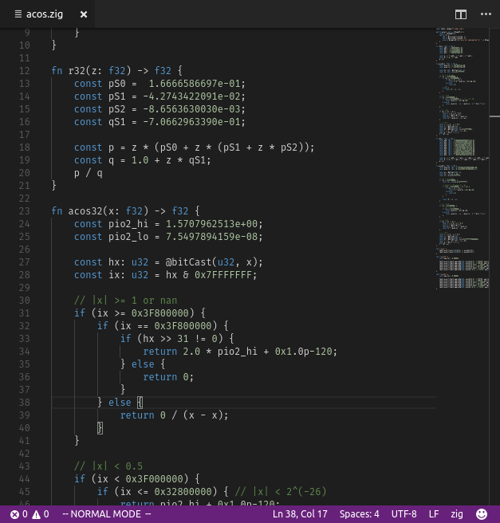

# vscode-zig

[](https://marketplace.visualstudio.com/items?itemName=ziglang.vscode-zig)
[](https://github.com/ziglang/vscode-zig/actions)

[Zig](http://ziglang.org/) support for Visual Studio Code.



## Features

- install and manage Zig version
- syntax highlighting
- basic compiler linting
- automatic formatting
- optional [Zig Language Server](https://github.com/zigtools/zls) features
  - completions
  - goto definition/declaration
  - document symbols
  - ... and [many more](https://github.com/zigtools/zls#features)

<!-- 
## Creating .vsix extension file

```
npm install
npm run compile
npx vsce package
``` -->
